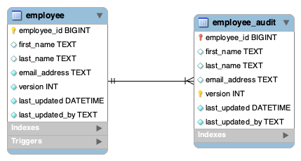

# sql-blog-audit (github.com/antonio-alexander/sql-blog-audit)

The purpose of this repo is to demonstrate how to implement audit tables within a database. Audit tables are a common need/desire for long-term database support/maintenance and scalability. Auditing allows you to answer some basic questions about each row/entity of data that otherwise might be difficult/impossible. It can also give you the ability to view changes and "undo" them or at least capture those changes such that they could be undone while maintaining any changes made after that. Auditing tables are best populated via triggers after updates/inserts into the table being audited. Although not necessary, the audit table should keep track of versions and create a "copy" of the source data with the assumption that the version will be updated for each atomic mutation of a given row.



These links may help:

- [https://www.mysqltutorial.org/mysql-stored-procedure-tutorial.aspx](https://www.mysqltutorial.org/mysql-stored-procedure-tutorial.aspx)
- [https://dev.mysql.com/doc/refman/5.7/en/trigger-syntax.html](https://dev.mysql.com/doc/refman/5.7/en/trigger-syntax.html)
- [https://mariadb.com/kb/en/delimiters/](https://mariadb.com/kb/en/delimiters/)
- [https://thispointer.com/error-code-1364-solved-field-doesnt-have-a-default-value/](https://thispointer.com/error-code-1364-solved-field-doesnt-have-a-default-value/)

## Getting Started

To bring up the containerized version of sql, you can issue the following commands in the root of the repository:

```sh
docker compose up -d
```

Although for some sql files, you can simply inject them at compose time into the docker-entrypoint-initdb.d folder, in this case, because the sql files contains triggers and setting/unsetting of the delimiter, it'll fail if you attempt to load it this way. We can resolve this issue by loading the sql file from the volumes, using the following command:

```sh
docker exec -it mysql mysql -u root -p$MYSQL_ROOT_PASSWORD < /tmp/employee_audit.sql
```

You can verify that loading the sql was successful with the following two commands:

```sh
docker exec -it mysql mysql -u root -p$MYSQL_ROOT_PASSWORD
```

You can then enter the following sql commands to verify:

```mysql
show databases;
use sql_blog_audit;
show tables;
```

You should see the following output:

```log
Welcome to the MariaDB monitor.  Commands end with ; or \g.
Your MariaDB connection id is 7
Server version: 10.6.8-MariaDB MariaDB Server

Copyright (c) 2000, 2018, Oracle, MariaDB Corporation Ab and others.

Type 'help;' or '\h' for help. Type '\c' to clear the current input statement.

MariaDB [(none)]> show databases;
+--------------------+
| Database           |
+--------------------+
| information_schema |
| mysql              |
| performance_schema |
| sql_blog_audit     |
| sys                |
+--------------------+
5 rows in set (0.002 sec)

MariaDB [(none)]> use sql_blog_audit;
Reading table information for completion of table and column names
You can turn off this feature to get a quicker startup with -A

Database changed
MariaDB [sql_blog_audit]> show tables;
+--------------------------+
| Tables_in_sql_blog_audit |
+--------------------------+
| employee                 |
| employee_audit           |
| team                     |
| team_audit               |
| team_employee            |
| team_employee_audit      |
+--------------------------+
6 rows in set (0.002 sec)

MariaDB [sql_blog_audit]> 
```

## Employee Audit Table

The audit tables are identical for practical purposes and the collection of triggers seeks to simplify, automate and to a degree prevent things that could make auditing inconsistent. In short, the collection of triggers and tables ensure that EVERY time a row on the base table (employee, team and team employees) is mutated, a "copy" of that data is inserted into the audit table. Audit tables as implemented, will answer the following questions:

- When did this edit on a specific row occur?
- What order did these specific edits occur?
- Who did this specific edit?
- What was changed in this specific edit?

To show the audit tables/triggers in action, lets insert an employee:

```sql
INSERT INTO employee(first_name, last_name, email_address) VALUES('Antonio','Alexander','antonio-alexander@mistersoftwaredeveloper.com');
SELECT * FROM employee;
SELECT * FROM employee_audit;
```

```log

MariaDB [sql_blog_audit]> SELECT * FROM employee;
+-------------+------------+-----------+-----------------------------------------------+---------+---------------------+-----------------+---------+
| employee_id | first_name | last_name | email_address                                 | version | last_updated        | last_updated_by | deleted |
+-------------+------------+-----------+-----------------------------------------------+---------+---------------------+-----------------+---------+
|           1 | Antonio    | Alexander | antonio-alexander@mistersoftwaredeveloper.com |       1 | 2025-05-26 21:03:50 | root@localhost  |       0 |
+-------------+------------+-----------+-----------------------------------------------+---------+---------------------+-----------------+---------+
1 row in set (0.001 sec)

MariaDB [sql_blog_audit]> SELECT * from employee_audit;
+-------------+------------+-----------+-----------------------------------------------+---------+---------------------+-----------------+---------+
| employee_id | first_name | last_name | email_address                                 | version | last_updated        | last_updated_by | deleted |
+-------------+------------+-----------+-----------------------------------------------+---------+---------------------+-----------------+---------+
|           1 | Antonio    | Alexander | antonio-alexander@mistersoftwaredeveloper.com |       1 | 2025-05-26 21:03:50 | root@localhost  |       0 |
+-------------+------------+-----------+-----------------------------------------------+---------+---------------------+-----------------+---------+
1 row in set (0.002 sec)
```

From the logs, you can see that the audit information was automatically updated and that the employee_audit table automatically inserted a row into the table as well. Below, we'll attempt to update that row that we just inserted.

```sql
UPDATE employee SET first_name='Tony' WHERE email_address='antonio-alexander@mistersoftwaredeveloper.com';
SELECT * FROM employee;
SELECT * FROM employee_audit;
```

```log
MariaDB [sql_blog_audit]> SELECT * FROM employee;
+-------------+------------+-----------+-----------------------------------------------+---------+---------------------+-----------------+---------+
| employee_id | first_name | last_name | email_address                                 | version | last_updated        | last_updated_by | deleted |
+-------------+------------+-----------+-----------------------------------------------+---------+---------------------+-----------------+---------+
|           1 | Tony       | Alexander | antonio-alexander@mistersoftwaredeveloper.com |       2 | 2025-05-26 21:08:07 | root@localhost  |       0 |
+-------------+------------+-----------+-----------------------------------------------+---------+---------------------+-----------------+---------+
1 row in set (0.001 sec)

MariaDB [sql_blog_audit]> SELECT * FROM employee_audit;
+-------------+------------+-----------+-----------------------------------------------+---------+---------------------+-----------------+---------+
| employee_id | first_name | last_name | email_address                                 | version | last_updated        | last_updated_by | deleted |
+-------------+------------+-----------+-----------------------------------------------+---------+---------------------+-----------------+---------+
|           1 | Antonio    | Alexander | antonio-alexander@mistersoftwaredeveloper.com |       1 | 2025-05-26 21:03:50 | root@localhost  |       0 |
|           1 | Tony       | Alexander | antonio-alexander@mistersoftwaredeveloper.com |       2 | 2025-05-26 21:08:07 | root@localhost  |       0 |
+-------------+------------+-----------+-----------------------------------------------+---------+---------------------+-----------------+---------+
2 rows in set (0.002 sec)
```

From the above logs, you should observe the following:

- insertion of an employee will automatically add audit information (version, last_updated, last_updated_by)
- insertion of an employee will automatically insert a row into the audit table
- update of an employee will automatically update audit information (version, last_updated, last_updated_by)
- update of an employee will automatically insert a row into the audit table

One of the ways that we ensure the audit table is logically consistent is by having a version that atomically increments each time a row is mutated (even by different users). As a result, the audit table should have a row each time a row is changed. This is accomplished using a variety of tools, but lets start with the employee table first:

```sql
CREATE TABLE IF NOT EXISTS `sql_blog_audit`.`employee` (
  `employee_id` BIGINT NULL DEFAULT NULL AUTO_INCREMENT,
  `first_name` TEXT NULL DEFAULT '',
  `last_name` TEXT NULL DEFAULT '',
  `email_address` TEXT NOT NULL,
  `version` INT NOT NULL DEFAULT 1,
  `last_updated` DATETIME NOT NULL DEFAULT CURRENT_TIMESTAMP,
  `last_updated_by` TEXT NOT NULL,
  `deleted` TINYINT NULL DEFAULT 0,
  PRIMARY KEY (`employee_id`),
  UNIQUE INDEX `uq_employee_email_address` (`email_address` ASC))
ENGINE = InnoDB;
```

The employee table has three fields to facilitate auditing:

- version: an integer that is atomically incremented each time a row is mutated
- last_updated: the database time where the mutation occurred
- last_updated_by: the database user that performed the mutation

Whenever a mutation occurs, the employee_audit table is updated, it has the following schema:

```sql
CREATE TABLE IF NOT EXISTS `sql_blog_audit`.`employee_audit` (
  `employee_id` BIGINT NULL DEFAULT NULL,
  `first_name` TEXT NULL DEFAULT NULL,
  `last_name` TEXT NULL DEFAULT NULL,
  `email_address` TEXT NULL DEFAULT NULL,
  `version` INT NOT NULL,
  `last_updated` DATETIME NOT NULL,
  `last_updated_by` TEXT NOT NULL,
  `deleted` TINYINT NULL,
  PRIMARY KEY (`employee_id`, `version`),
  UNIQUE INDEX `uq_employee_audit_version` (`employee_id` ASC, `version` ASC),
  CONSTRAINT `fk_employee_audit_employee_id`
    FOREIGN KEY (`employee_id`)
    REFERENCES `sql_blog_audit`.`employee` (`employee_id`)
    ON DELETE CASCADE)
ENGINE = InnoDB;
```

Note that although this table shares the same values as the employee table, it's unique in that it:

- only has one foreign key constraint (on employee id)
- only enforced NOT NULL for audit fields (version, last_updated, last_updated_by)
- has a primary key of employee_id and version

Those changes ensure that if an employee is deleted, it's audit table entries are ALSO deleted (maintaining data consistency) as well as ensuring that the audit table remains consistent in that there should only be a single entry per employee per version. Now you may be asking yourself, how can we ensure that the audit values are always sane, we do that through a trigger that runs AFTER INSERT and BEFORE UPDATE on the employee table (see [employee_audit.sql](./sql/employee_audit.sql))

```sql
DELIMITER $$

CREATE TRIGGER employee_audit_insert
AFTER INSERT
    ON employee FOR EACH ROW BEGIN
INSERT INTO
    employee_audit(employee_id, first_name, last_name, email_address, version, last_updated, last_updated_by)
values
    (new.employee_id, new.first_name,  new.last_name, new.email_address, new.version, new.last_updated, new.last_updated_by);
END$$

CREATE TRIGGER employee_audit_info_update
BEFORE UPDATE
    ON employee FOR EACH ROW
BEGIN
    SET new.version = old.version+1, new.last_updated = CURRENT_TIMESTAMP, new.last_updated_by = CURRENT_USER;
END$$

DELIMITER ;
```

These triggers effectively override any values set to ensure that they're sane and not spoofed. If version was incorrect for some reason, the trigger could fail forcing a rollback of the original transaction (e.g. the current mutex is 5 and it's set to 5 or 4) and we prevent situations where users could _try_ to masquerade as someone else. There's also the option of having a separate table altogether that has the "live" audit information, but I think this is more practical.

We also use a trigger to automate insertions to the audit tables:

```sql
DELIMITER $$

CREATE TRIGGER employee_audit_info_insert
BEFORE INSERT
    ON employee FOR EACH ROW
BEGIN
    SET new.last_updated = CURRENT_TIMESTAMP, new.last_updated_by = CURRENT_USER;
END$$

CREATE TRIGGER employee_audit_update
AFTER UPDATE
    ON employee FOR EACH ROW BEGIN
INSERT INTO
    employee_audit(employee_id, first_name, last_name, email_address, version, last_updated, last_updated_by)
values
    (new.employee_id, new.first_name,  new.last_name, new.email_address, new.version, new.last_updated, new.last_updated_by);
END$$

DELIMITER ;
```

Each time a mutation happens to the employee table, an insert is made to the audit table capturing each mutation.

## Auditing vs History

When working with auditing, you may get the clever idea to use it as history (or something other than auditing). While the information contained in an audit table _could_ be used for history, the purpose of history vs audit is incredibly different. And it's this difference that makes you not be able to use them for both purposes.

An audit table should be used for the following:

- to determine who has modified a specific row
- to determine what was modified in a specific row
- to determine when a modification was made to a specific row

A history table should be used for the following:

- to see previous versions of a specific row
- to see what changes have been made to a specific row

Additionally, a history table is unique in that although it's _unlikely_ that you would mutate history, because of its consumer, there's plenty of valid reasons to __need__ to be able to mutate its history. For example, what if the history is __wrong__ because of a typo or privileged information that the consumers of the table shouldn't be privy to?

An audit table, by definition, cannot be modified; in order to have one table to be able to perform auditing AND history, __we'd have to ruin the consistency of our audit table__

Be careful about using audit tables for anything other than auditing, audit tables should be considered read-only except for when you delete data you no longer care about auditing (i.e., delete all audit data before data x).

## Deletion

Although deletion of a given row is something that matters outside of auditing, it's something to keep in mind; mostly for academic purposes. For example, if an employee gets deleted, is it expected that the audit tables ALSO get deleted? or is it expected that those rows remain? Does it make sense for rows to exist in the audit table that don't also exist in the data table?

My _opinion_ is that [soft-deletes](https://github.com/antonio-alexander/sql-blog-soft-delete) should be implemented when you want to logically delete something (thereby maintaining the audit tables) and then hard delete when you're actually done with the row. Although it would "ruin" the ability to audit that row, if the row no longer exists it matters a little less.
